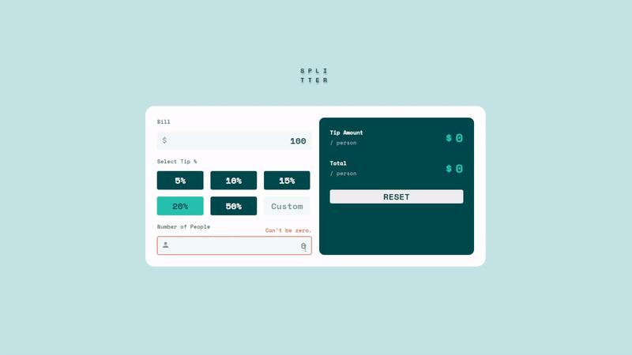

# Splitter

  

## ⚙️ Features

- Take user inputs and calculate tip and bill to split with friends
- Responsive design

## 📌 Lessons from the project

- To learn styling the `<form>` element and the `<input>` element
- To use Using media queries in Sass

## 💻 Technologies

- HTML
- Sass
- JavaScript

## 🔨 Set up

- Download and install Git
- `> git clone https://github.com/chepark/splitter.git`
- Open `index.html` file on a browser.
